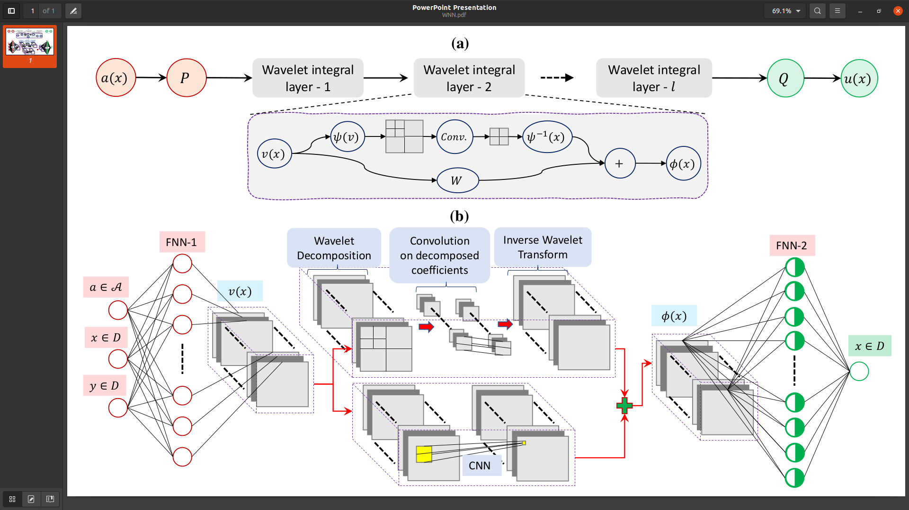
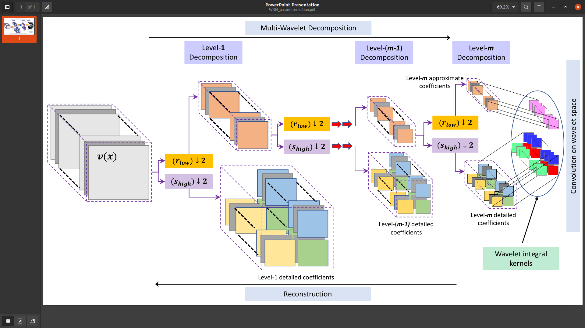

# Wavelet-Neural-Operator-for-pdes
This repository contains the python codes of the paper 
  > + "Wavelet  Neural  Operator  for  solving  parametric  partialdifferential  equations  in  computational  mechanics  problems", authored by Tapas Tripura and Souvik Chakraborty.
  > + In arXiv version this article can be searched as "Wavelet neural operator: a neural operator for parametric partial differential equations". The arXiv version can be accessed [here](https://arxiv.org/abs/2208.05609).

# Architecture of the wavelet neural operator (WNO). 
(a) Schematic of the proposed neural operator. (b) A simple WNO with one wavelet kernel integral layer. 


# Construction of the parametric space using multiwavelet decomposition.


# Files
A short despcription on the files are provided below for ease of readers.
  + `wno_1d_Advection_time_III.py`: This code is for 1-D wave advection equation (time-dependent problem).
  + `wno_1d_Burger_discontinuous.py`: This code is for 1-D Burgers' equation with discontinuous field (time-dependent problem).
  + `wno_1d_Burgers.py`: This code is for 1-D Burger's equation (time-independent problem).
  + `Example_4_boucwen.py`: This code is for 2-D Allen-Cahn equation (time-independent problem).
  + `wno_2d_AC.py`: This code is for 2-D Darcy equation (time-independent problem).
  + `wno_2d_Darcy.py` contains useful functions, like, library construction, data-normalization.
  + `wno_2d_Darcy_notch.py`: This code is for 2-D Darcy equation in triangular domain with notch (time-independent problem).
  + `wno_2d_ERA5.py`: This code is for forecast of monthly averaged 2m air temperature (time-independent problem).
  + `wno_2d_ERA5_time.py`: This code is for weekly forecast of 2m air temperature (time-dependent problem).
  + `wno_2d_time_NS.py`: This code is for 2-D Navier-Stokes equation (2D time-dependent problem).
  + `utilities3.py` is the code to generate data using stochastic calculus.
The codes for the *Stochastic SINDy* are provided in the folder *Stochastic_Sindy*.

# Library support
Following packages are required to be installed to run the above codes:
  + [PyTorch](https://pytorch.org/)
  + [PyWavelets - Wavelet Transforms in Python](https://pywavelets.readthedocs.io/en/latest/)
  + [Wavelet Transforms in Pytorch](https://github.com/fbcotter/pytorch_wavelets)
  + Xarray-Grib reader [Link-1](https://docs.xarray.dev/en/stable/getting-started-guide/installing.html?highlight=install) [Link-2](https://anaconda.org/anaconda/xarray)\
Copy all the data in the folder 'data' and place the folder 'data' inside the same mother folder where the codes are present.	Incase, the location of the data are changed, the correct path should be given.

# Testing
For performing predictions on new inputs, one can use the 'WNO_testing_(.).py' codes given in the `Testing` folder. The trained models, that were used to produce results for the WNO paper can be found in the following link:
  > [Models](https://drive.google.com/drive/folders/1scfrpChQ1wqFu8VAyieoSrdgHYCbrT6T?usp=sharing)

# Dataset
  + The training and testing datasets for the (i) Burgers equation with discontinuity in the solution field (section 4.1), and (ii) 2-D Allen-Cahn equation (section 4.5), are available in the following link:
    > [Dataset-1](https://drive.google.com/drive/folders/1scfrpChQ1wqFu8VAyieoSrdgHYCbrT6T?usp=sharing)
  + The datasets for (i) 1-D Burgers equation ('burgers_data_R10.zip'), (ii) 2-D Darcy flow equation in a rectangular domain ('Darcy_421.zip'), (iii) 2-D time-dependent Navier-Stokes equation ('ns_V1e-3_N5000_T50.zip'), are taken from the following link:
    > [Dataset-2](https://drive.google.com/drive/folders/1UnbQh2WWc6knEHbLn-ZaXrKUZhp7pjt-)
  + The datasets for 2-D Darcy flow equation with a notch in triangular domain ('Darcy_Triangular_FNO.mat') is taken from following:
    > [Dataset-3](https://drive.google.com/drive/folders/183zFbUqBG3uMthqG16foi5l7vKPPJZ02)
  + The datasets for 1-D time-dependent wave advection equation, is taken from the following link:
    > [Dataset-4](https://drive.google.com/drive/folders/1oAh2mUd7YRW8boiCGU_vURfcyYVPJiH3)

# BibTex
If you use any part our codes, please cite us at,
```
@article{tripura2022wavelet,
  title={Wavelet neural operator: a neural operator for parametric partial differential equations},
  author={Tripura, Tapas and Chakraborty, Souvik},
  journal={arXiv preprint arXiv:2205.02191},
  year={2022}
}
```
